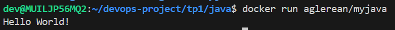
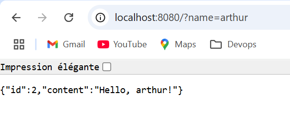
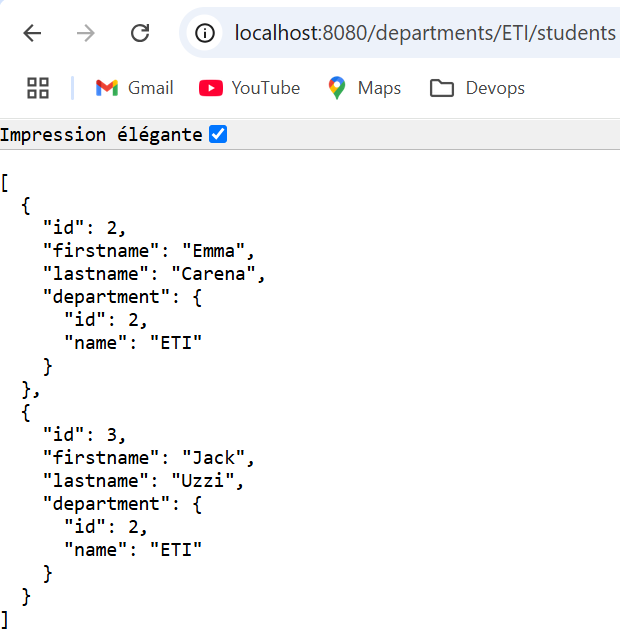

## TP1 - Docker

## Database

**1-1 Why should we run the container with a flag -e to give the environment variables?**

Il serait préférable de passer par des variables d'environnement pour des raisons de sécurité et de bonnes pratiques.

**1-2 Why do we need a volume to be attached to our postgres container ?**

Les volumes sont notamment utiles pour les dump ou imports des bases. Ici, il est utile pour tirer les données avant la destruction d'un conteneur (données persistantes).

**1-3 Document your database container essentials: commands and Dockerfile.**

`docker run --net=app-network -v /home/dev/devops-project/tp1/bdd/data:/var/lib/postgresql/data --name=mydatabase
 -d  aglerean/mydatabase`

Dockerfile:
```yaml
FROM postgres:14.1-alpine

ENV POSTGRES_DB=db \
   POSTGRES_USER=user \
   POSTGRES_PASSWORD=password

COPY initial_data.sql /docker-entrypoint-initdb.d
```
## Backend API



*Dockerfile :*
```yaml
# Build
FROM maven:3.9.9-amazoncorretto-21 AS myapp-build
ENV MYAPP_HOME=/opt/myapp 
WORKDIR $MYAPP_HOME
COPY simpleapi/pom.xml .
COPY simpleapi/src ./src
RUN mvn package -DskipTests

# Run
FROM amazoncorretto:21
ENV MYAPP_HOME=/opt/myapp 
WORKDIR $MYAPP_HOME
COPY --from=myapp-build $MYAPP_HOME/target/*.jar $MYAPP_HOME/myapp.jar

ENTRYPOINT ["java", "-jar", "myapp.jar"]
```

*Commande de lancement :* `docker run -p 8080:8080 aglerean/myapi`

**1-4 Why do we need a multistage build? And explain each step of this dockerfile.**

Nous avons besoin de 2 images: une image maven pour compiler l'applicatif Spring et une image JDK pour exécuter le .jar généré.

Dans un premier temps, on copie les ressources nécessaires à la compilation du projet dans l'image maven (sources et pom.xml pour les dépendances). Le projet est ensuite compilé avec la commande maven (`mvn package -DskipTests`).

Ensuite, le .jar généré dans l'image maven est copié pour pouvoir l'exécuter depuis java, via la commande: `ENTRYPOINT ["java", "-jar", "myapp.jar"]`.

Le build de l'image et le démaragge du conteneur étant fait, on obtient:



Avec le projet d'API et la configuration rattachée à notre base Postgresql, on obtient:



Configuration BDD `application.properties` > jdbc:postgresql://mydatabase:5432/db

