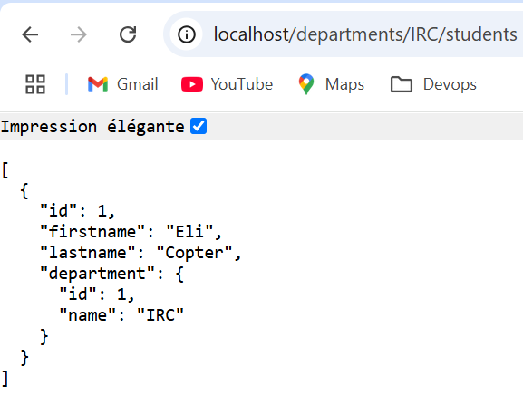

## TP1 - Docker

## Database

**1-1 Why should we run the container with a flag -e to give the environment variables?**

Il serait préférable de passer par des variables d'environnement pour des raisons de sécurité et de bonnes pratiques.

**1-2 Why do we need a volume to be attached to our postgres container ?**

Les volumes sont notamment utiles pour les dump ou imports des bases. Ici, il est utile pour tirer les données avant la destruction d'un conteneur (données persistantes).

**1-3 Document your database container essentials: commands and Dockerfile.**

`docker run --net=app-network -v /home/dev/devops-project/tp1/bdd/data:/var/lib/postgresql/data --name=mydatabase
 -d  aglerean/mydatabase`

Dockerfile:
```yaml
FROM postgres:14.1-alpine

ENV POSTGRES_DB=db \
   POSTGRES_USER=user \
   POSTGRES_PASSWORD=password

COPY initial_data.sql /docker-entrypoint-initdb.d
```
## Backend API


*Dockerfile :*
```yaml
# Build
FROM maven:3.9.9-amazoncorretto-21 AS myapp-build
ENV MYAPP_HOME=/opt/myapp 
WORKDIR $MYAPP_HOME
COPY simpleapi/pom.xml .
COPY simpleapi/src ./src
RUN mvn package -DskipTests

# Run
FROM amazoncorretto:21
ENV MYAPP_HOME=/opt/myapp 
WORKDIR $MYAPP_HOME
COPY --from=myapp-build $MYAPP_HOME/target/*.jar $MYAPP_HOME/myapp.jar

ENTRYPOINT ["java", "-jar", "myapp.jar"]
```

*Commande de lancement :* `docker run -p 8080:8080 aglerean/myapi`

**1-4 Why do we need a multistage build? And explain each step of this dockerfile.**

Nous avons besoin de 2 images: une image maven pour compiler l'applicatif Spring et une image JDK pour exécuter le .jar généré.

Dans un premier temps, on copie les ressources nécessaires à la compilation du projet dans l'image maven (sources et pom.xml pour les dépendances). Le projet est ensuite compilé avec la commande maven (`mvn package -DskipTests`).

Ensuite, le .jar généré dans l'image maven est copié pour pouvoir l'exécuter depuis java, via la commande: `ENTRYPOINT ["java", "-jar", "myapp.jar"]`.

Le build de l'image et le démaragge du conteneur étant fait, on obtient:


Avec le projet d'API et la configuration rattachée à notre base Postgresql, on obtient:


Configuration BDD `application.properties` > jdbc:postgresql://mydatabase:5432/db

**1-5 Pourquoi avons-nous besoin d’un proxy inverse ?**

On utilise un reverse proxy principalement pour des raisons de sécurité.

On expose uniquement le serveur proxy, et non directement l'app.

On peut gérer la répartition de charge si l'on avait plusieurs sources.

\+ Gestion du SSL/TLS

\+ Gestion de la configuration du serveur web

Après avoir lancé Apache, on accède aux APIs via localhost :



**1-6 Pourquoi docker-compose est -il si important ?**

Docker-compose est important car il permet de construire un système de manière cohérente et logique, réuni dans un seul fichier. Il permet d'être beaucoup plus rapide et d'avoir une vision d'ensemble sur les applicatifs d'un projet.

**1-7 Documentez les commandes les plus importantes de docker-compose. 1-8 Documentez votre fichier docker-compose.**

`docker-compose up -d` : build et run les conteneurs en tâche de fond.
`docker-compose down -v` : arrêter et supprimer les conteneurs, ainsi que leurs volumes.
`docker-compose logs -f` : afficher les logs.
`docker-compose ps` : afficher l'état des conteneurs.
`docker-compose exec <conteneur> ...` : exécuter une commande dans un conteneur en cours d'exécution.

*Le docker-compose crée :*

```yaml
version: '3.7'

services:
    myapi:
        build:
          context: ./java
          dockerfile: Dockerfile
        networks:
          - app-network
        depends_on:
          - mydatabase
        ports:
          - "8080:8080"

    mydatabase:
        env_file: ".env"
        image: postgres:14.1-alpine
        environment:
          POSTGRES_DB: ${PSQL_DB}
          POSTGRES_USER: ${PSQL_USR}
          POSTGRES_PASSWORD: ${PSQL_PWD}
        volumes:
          # - ./bdd/initial_data.sql:/docker-entrypoint-initdb.d
          - ./bdd/data:/var/lib/postgresql/data
        networks:
          - app-network

    httpd:
        image: httpd:2.4
        container_name: myhttpd
        ports:
          - "80:80"
        volumes:
          - ./httpd/index.html:/usr/local/apache2/htdocs/index.html
          - ./httpd/httpd.conf:/usr/local/apache2/conf/httpd.conf
        depends_on:
          - myapi
        networks:
          - app-network

networks:
    app-network:
      name: app-network
```

**1-9 Documentez vos commandes de publication et vos images publiées dans dockerhub.**

`docker tag tp1_backend aglerean/tp1_backend:1.0` > Tag sur mon image backend (API sur les étudiants CPE au numéro de version 1.0).

`docker push aglerean/tp1_backend:1.0` > Pousser mon image sur le docker hub.

**1-10 Pourquoi mettons-nous nos images dans un référentiel en ligne ?**

Pour pouvoir les récupérer sur n'importe quelle machine et permettre à d'autres personnes de pouvoir les utiliser.